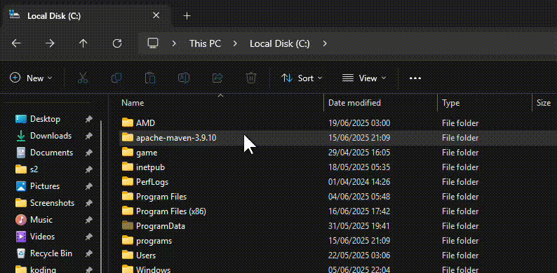
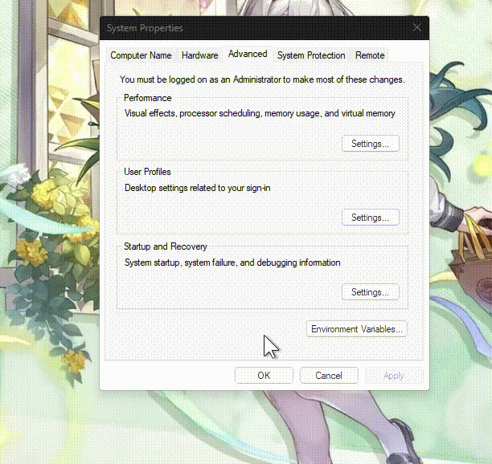

# MASTER-SLAVE-SERVER

*by Rifky D.R. Prakoso & Arzaq Vincent P. Prasetyo*


[](https://instagram.com/rifky.prakoso_)
[](https://instagram.com/notorfix2)

Built with the tools and technologies:


Proyek ini mendemonstrasikan cara menghubungkan program Java ke server MongoDB dengan konfigurasi master-slave (*replica set*) secara *remote*. Berikut adalah langkah-langkahnya:

## 1. Siapkan Resources
* Windows (10/11) sebagai *Host*
* [VirtualBox](https://www.virtualbox.org/wiki/Downloads)
* [ISO Ubuntu Server 24.04 LTS](https://releases.ubuntu.com/24.04.2/ubuntu-24.04.2-live-server-amd64.iso) (versi LTS terbaru saat panduan ini dibuat)
* [Java SE Development Kit 21](https://download.oracle.com/java/21/latest/jdk-21_windows-x64_bin.msi) (versi LTS terbaru saat panduan ini dibuat)
* [Maven 3.9.10](https://dlcdn.apache.org/maven/maven-3/3.9.10/binaries/apache-maven-3.9.10-bin.zip) (versi *Stable* terbaru saat panduan ini dibuat)

## 2. Instalasi
### 1. Ubuntu Server
Lakukan instalasi Ubuntu Server di VirtualBox dengan konfigurasi jaringan ***Bridged Adapter***. Pastikan untuk menginstal server OpenSSH selama proses instalasi. Hal ini akan mempermudah pengerjaan karena kita dapat me-*remote* server Ubuntu dari Windows menggunakan perintah `ssh` di Terminal.

Tautan Tutorial YouTube: [Cara menginstall ubuntu server untuk membuat master-slave server](https://youtu.be/aOOu2Psx9lk)

### 2. Install Java

### 3. Install Maven
#### Ekstrak file Maven ke folder yang Anda inginkan (contoh `C:\apache-maven-3.9.10`)

#### Buka folder `bin` di dalam direktori Maven, lalu salin *path*-nya (`C:\apache-maven-3.9.10\bin`)


#### Cari dan buka `Edit the system environment variables`


#### Pilih `Environment Variables` ▶️ klik dua kali pada variabel `Path` ▶️ pilih `New` ▶️ tempelkan (*paste*) *path* yang sudah disalin sebelumnya ▶️ tekan `OK` pada semua jendela yang terbuka


## 3. Setup Project
Buka `cmd` di direktori yang Anda inginkan (contoh `C:\projek`)


Lalu jalankan perintah berikut untuk membuat proyek Maven baru
```bash
mvn archetype:generate -DgroupId=local -DartifactId=mongo-app -DarchetypeArtifactId=maven-archetype-quickstart -DarchetypeVersion=1.5 -DinteractiveMode=false
```
Setelah perintah selesai dieksekusi, sebuah folder baru dengan nama yang sesuai dengan `-DartifactId` (yaitu `mongo-app`) akan dibuat. Masuk ke dalam direktori tersebut
```bash
cd mongo-app
```
Buka file `pom.xml` dan ganti seluruh isinya dengan konfigurasi berikut
```xml
<?xml version="1.0" encoding="UTF-8"?>
<project xmlns="http://maven.apache.org/POM/4.0.0" xmlns:xsi="http://www.w3.org/2001/XMLSchema-instance"
  xsi:schemaLocation="http://maven.apache.org/POM/4.0.0 http://maven.apache.org/xsd/maven-4.0.0.xsd">
  <modelVersion>4.0.0</modelVersion>

  <groupId>local</groupId>
  <artifactId>mongo-app</artifactId>
  <version>1.0-SNAPSHOT</version>

  <name>mongo-app</name>
  <!-- FIXME change it to the project's website -->
  <url>http://www.example.com</url>

  <properties>
    <project.build.sourceEncoding>UTF-8</project.build.sourceEncoding>
    <maven.compiler.release>17</maven.compiler.release>
  </properties>

  <dependencyManagement>
    <dependencies>
      <dependency>
        <groupId>org.junit</groupId>
        <artifactId>junit-bom</artifactId>
        <version>5.13.1</version>
        <type>pom</type>
        <scope>import</scope>
      </dependency>
    </dependencies>
  </dependencyManagement>

  <dependencies>
    <dependency>
      <groupId>org.junit.jupiter</groupId>
      <artifactId>junit-jupiter-api</artifactId>
      <scope>test</scope>
    </dependency>
    <!-- Optionally: parameterized tests support -->
    <dependency>
      <groupId>org.junit.jupiter</groupId>
      <artifactId>junit-jupiter-params</artifactId>
      <scope>test</scope>
    </dependency>
	
	<dependency>
      <groupId>org.mongodb</groupId>
      <artifactId>mongodb-driver-sync</artifactId>
      <version>5.5.1</version>
    </dependency>
	
  </dependencies>

  <build>
    <pluginManagement><!-- lock down plugins versions to avoid using Maven defaults (may be moved to parent pom) -->
      <plugins>
        <!-- clean lifecycle, see https://maven.apache.org/ref/current/maven-core/lifecycles.html#clean_Lifecycle -->
        <plugin>
          <artifactId>maven-clean-plugin</artifactId>
          <version>3.4.0</version>
        </plugin>
        <!-- default lifecycle, jar packaging: see https://maven.apache.org/ref/current/maven-core/default-bindings.html#Plugin_bindings_for_jar_packaging -->
        <plugin>
          <artifactId>maven-resources-plugin</artifactId>
          <version>3.3.1</version>
        </plugin>
        <plugin>
          <artifactId>maven-compiler-plugin</artifactId>
          <version>3.13.0</version>
        </plugin>
        <plugin>
          <artifactId>maven-surefire-plugin</artifactId>
          <version>3.3.0</version>
        </plugin>
        <plugin>
          <artifactId>maven-jar-plugin</artifactId>
          <version>3.4.2</version>
        </plugin>
        <plugin>
          <artifactId>maven-install-plugin</artifactId>
          <version>3.1.2</version>
        </plugin>
        <plugin>
          <artifactId>maven-deploy-plugin</artifactId>
          <version>3.1.2</version>
        </plugin>
        <!-- site lifecycle, see https://maven.apache.org/ref/current/maven-core/lifecycles.html#site_Lifecycle -->
        <plugin>
          <artifactId>maven-site-plugin</artifactId>
          <version>3.12.1</version>
        </plugin>
        <plugin>
          <artifactId>maven-project-info-reports-plugin</artifactId>
          <version>3.6.1</version>
        </plugin>
		
		<plugin>
          <artifactId>maven-assembly-plugin</artifactId>
          <version>3.6.0</version>
          <configuration>
            <descriptorRefs>
              <descriptorRef>jar-with-dependencies</descriptorRef>
            </descriptorRefs>
            <archive>
              <manifest>
                <mainClass>local</mainClass>
              </manifest>
            </archive>
          </configuration>
          <executions>
            <execution>
              <id>make-assembly</id>
              <phase>package</phase>
              <goals>
                <goal>single</goal>
              </goals>
            </execution>
          </executions>
        </plugin>
		
      </plugins>
    </pluginManagement>
  </build>
</project>
```
Setelah menyimpan perubahan pada `pom.xml`, jalankan perintah berikut untuk membuat file `.jar`
```bash
mvn clean compile assembly:single
```
Tunggu hingga proses selesai dan muncul pesan `BUILD SUCCESS`. Kemudian, jalankan perintah berikut
```bash
java -jar target\mongo-app-1.0-SNAPSHOT-jar-with-dependencies.jar
```
Jika output `Hello World!` muncul di konsol, maka Anda telah berhasil mengatur proyek Java dengan benar


## 4. Instalasi MongoDB Community Edition di Setiap Server
### Impor kunci publik GPG MongoDB
```bash
curl -fsSL https://www.mongodb.org/static/pgp/server-8.0.asc | \
   sudo gpg -o /usr/share/keyrings/mongodb-server-8.0.gpg \
   --dearmor
```
### Buat *list file* untuk MongoDB
```bash
echo "deb [ arch=amd64,arm64 signed-by=/usr/share/keyrings/mongodb-server-8.0.gpg ] https://repo.mongodb.org/apt/ubuntu noble/mongodb-org/8.0 multiverse" | sudo tee /etc/apt/sources.list.d/mongodb-org-8.0.list
```

### Muat ulang *database package* lokal
```bash
sudo apt update
```

### Install MongoDB Community Server
```bash
sudo apt-get install -y mongodb-org
```

### Jalankan MongoDB
```bash
sudo systemctl start mongod
```

### Verifikasi bahwa MongoDB telah berhasil dijalankan
```bash
sudo systemctl status mongod
```

### Aktifkan layanan MongoDB agar berjalan otomatis saat *booting*
```bash
sudo systemctl enable mongod
```

Sumber: [Install MongoDB Community Edition on Ubuntu](https://www.mongodb.com/docs/manual/tutorial/install-mongodb-on-ubuntu/)

## 5. Setup MongoDB untuk Replica Set
### Periksa *IP Address* dari setiap server
```bash
hostname -I
```

### Ubah `bindIp` & `replSetName` di `/etc/mongod.conf` pada kedua server
Gunakan editor `nano` untuk mengubah file konfigurasi MongoDB
```bash
sudo nano /etc/mongod.conf
```
Setelah file terbuka, isinya akan terlihat seperti ini
```yaml
# mongod.conf

# for documentation of all options, see:
#   http://docs.mongodb.org/manual/reference/configuration-options/

# Where and how to store data.
storage:
  dbPath: /var/lib/mongodb
#  engine:
#  wiredTiger:

# where to write logging data.
systemLog:
  destination: file
  logAppend: true
  path: /var/log/mongodb/mongod.log

# network interfaces
net:
  port: 27017
  bindIp: 127.0.0.1


# how the process runs
processManagement:
  timeZoneInfo: /usr/share/zoneinfo

#security:

#operationProfiling:

#replication:

#sharding:

## Enterprise-Only Options:

#auditLog:
```
Tambahkan *IP Address* yang sebelumnya didapatkan dari `hostname -I` ke baris `bindIp`, pisahkan dengan koma (contoh `192.168.33.70`)
```yaml
net:
  port: 27017
  bindIp: 127.0.0.1, 192.168.33.70
```
Cari bagian `#replication:` dan aktifkan dengan menghapus tanda pagar (`#`), lalu tambahkan `replSetName: "rs0"`
```yaml
replication:
  replSetName: "rs0"
```
Sekarang, keseluruhan isi file `mongod.conf` Anda akan terlihat seperti ini
```yaml
# mongod.conf

# for documentation of all options, see:
#   http://docs.mongodb.org/manual/reference/configuration-options/

# Where and how to store data.
storage:
  dbPath: /var/lib/mongodb
#  engine:
#  wiredTiger:

# where to write logging data.
systemLog:
  destination: file
  logAppend: true
  path: /var/log/mongodb/mongod.log

# network interfaces
net:
  port: 27017
  bindIp: 127.0.0.1, 192.168.33.70


# how the process runs
processManagement:
  timeZoneInfo: /usr/share/zoneinfo

#security:

#operationProfiling:

replication:
  replSetName: "rs0"

#sharding:

## Enterprise-Only Options:

#auditLog:
```
Tekan `Ctrl + O` kemudian `Enter` untuk menyimpan perubahan, tekan `Ctrl + X` untuk keluar dari `nano`

Agar perubahan pada `mongod.conf` dapat diterapkan, kita perlu me-*restart* layanan `mongod`
```bash
sudo systemctl restart mongod
```

## 6. Deploy Replica Set
### Langkah ini HANYA dilakukan di salah satu server, yang akan menjadi *node* PRIMARY
Masuk ke *shell* MongoDB di server PRIMARY
```bash
mongosh
```
Di dalam *shell* MongoDB, jalankan perintah berikut. Pastikan untuk mengganti `GANTI_IP_PRIMARY` dan `GANTI_IP_SECONDARY` dengan alamat IP server Anda yang sesuai
```js
rs.initiate(
  {
    _id: "rs0",
    members: [
      { _id: 0, host: "GANTI_IP_PRIMARY:27017" },
      { _id: 1, host: "GANTI_IP_SECONDARY:27017" }
    ]
  }
)
```
Tunggu beberapa saat hingga *prompt* di *shell* Anda berubah menjadi `rs0:PRIMARY>`

### Verifikasi Status
```js
rs.status()
```
Pastikan kedua anggota (`IP_PRIMARY:27017` dan `IP_SECONDARY:27017`) muncul dalam daftar, di mana satu berstatus `PRIMARY` dan yang lainnya `SECONDARY`, serta keduanya memiliki nilai `health: 1`

## 7. Menyiapkan dan Menjalankan Program Java di *Host* (Windows)
### Ubah seluruh isi file `App.java` yang berlokasi di `C:\projek\mongo-app\src\main\java\local\App.java` dengan kode di bawah ini
```java
package local;

import com.mongodb.MongoClientSettings;
import com.mongodb.MongoException;
import com.mongodb.client.*;
import com.mongodb.client.model.InsertOneOptions;
import org.bson.Document;
import static com.mongodb.client.model.Filters.regex;

import java.io.*;
import java.util.*;

public class App {
	String PORT_MASTER = "192.x.x.x:27017"; // IP_PRIMARY:PORT
	String PORT_SLAVE = "192.x.x.x:27017"; // IP_SECONDARY:PORT

	public void insert() {
		String uri = "mongodb://" + PORT_MASTER + "," + PORT_SLAVE;
		String dbName = "test"; // nama database;
		String collName = "data_apalah"; // nama collection/table;

		try (MongoClient mongoClient = MongoClients.create(uri)) {
			MongoDatabase database = mongoClient.getDatabase(dbName);
			MongoCollection<Document> collection = database.getCollection(collName);

			Document doc = new Document();
			doc.append("name", "buidanto");
			doc.append("nim", "123456");

			try {
				collection.insertOne(doc, new InsertOneOptions());
				System.out.println("Insert data success");
			} catch (MongoException me) {
				System.err.println("Insert failed: " + me.getMessage());
			}
		} catch (Exception e) {
			System.err.println("[ERROR]: " + e.getMessage());
		}
	}

	public static void main(String[] args) {
		App app = new App();
		app.insert();
	}
}
```
Setelah mengubah isi `App.java`, jalankan kembali perintah berikut untuk membersihkan *cache* sebelumnya dan mengkompilasi ulang proyek
```bash
mvn clean compile assembly:single
```
Kemudian, jalankan file `.jar` yang telah dibuat
```bash
java -jar target\mongo-app-1.0-SNAPSHOT-jar-with-dependencies.jar
```
Apabila muncul output `Insert data success`, maka program telah sukses dijalankan dan data berhasil dimasukkan ke dalam server MongoDB

## 8. Verifikasi Data pada Replica Set MongoDB
Masuk kembali ke *shell* MongoDB di server mana pun (PRIMARY atau SECONDARY)
```js
// Ganti dengan nama database yang Anda gunakan di Java
use NAMA_DATABASE_ANDA;

// Ganti dengan nama collection yang Anda gunakan di Java
db.NAMA_COLLECTION_ANDA.find().pretty();
```
Anda seharusnya dapat melihat data yang baru saja dimasukkan. Untuk memverifikasi di server SECONDARY, Anda mungkin perlu menjalankan perintah `rs.secondaryOk()` terlebih dahulu sebelum menjalankan perintah diatas


 
